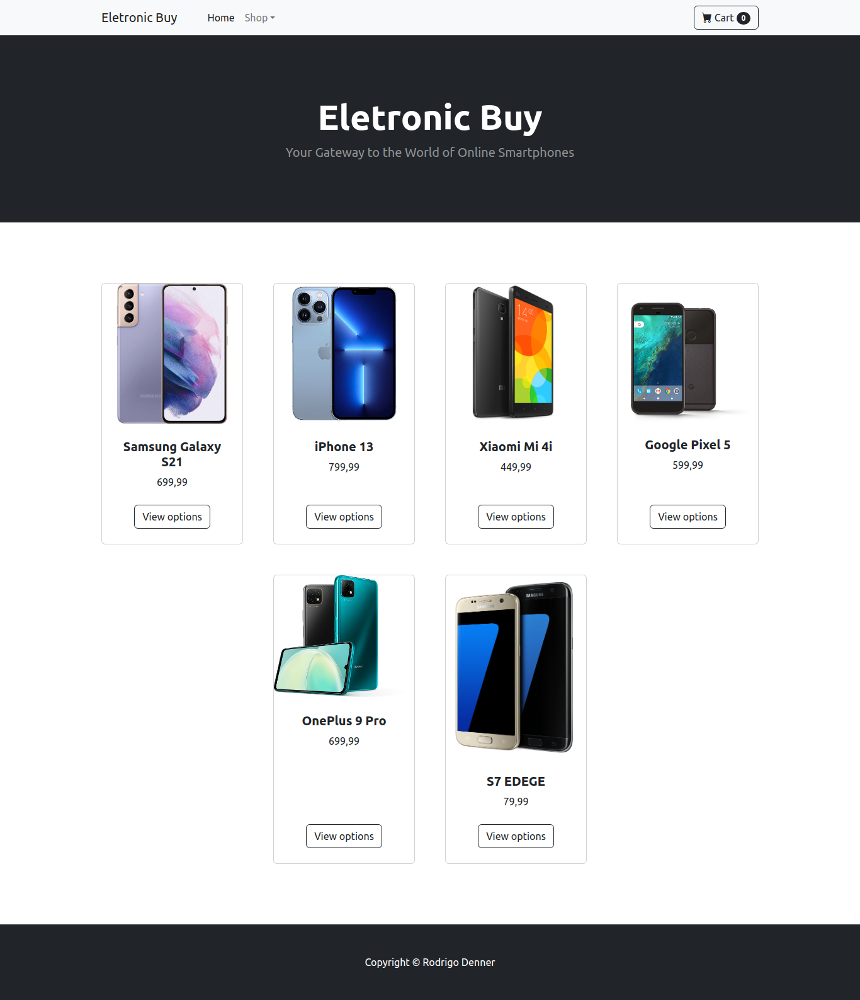
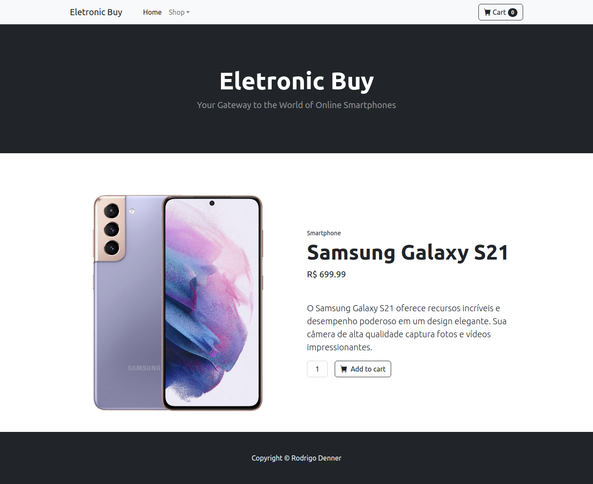

# Eletronicbuy - Plataforma de E-commerce

 

O Eletronicbuy é uma plataforma de comércio eletrônico simples, desenvolvida em PHP puro com a arquitetura MVC. Ele permite aos usuários comprar produtos eletrônicos de diferentes tipos. Os detalhes dos produtos são armazenados em um banco de dados MySQL, mas você também pode optar por usar um arquivo `helpers.php` para simular um banco de dados.

## Funcionalidades Principais

- Cadastro de produtos com informações detalhadas.
- Navegação fácil entre diferentes tipos de produtos.
- Visualização de produtos com imagens.
- Carrinho de compras para adicionar e gerenciar produtos.

 
## Pré-requisitos

Certifique-se de ter o seguinte instalado no seu ambiente de desenvolvimento:

- PHP (versão recomendada)
- Composer (para uso do banco de dados MySQL)
- MySQL (caso deseje usar o banco de dados real)

## Instalação

### Usando o Banco de Dados MySQL

1. Clone o repositório do Eletronicbuy: `git clone https://github.com/seuusuario/eletronicbuy.git`
2. Navegue até o diretório do projeto: `cd eletronicbuy`
3. Instale as dependências com Composer: `composer install`
4. Configure o banco de dados no arquivo `.env`.
5. Execute as migrações para criar as tabelas do banco de dados: `php artisan migrate`

 

### Usando o Banco de Dados Simulado (helpers.php)

1. Clone o repositório do Eletronicbuy: `git clone https://github.com/seuusuario/eletronicbuy.git`
2. Navegue até o diretório do projeto: `cd eletronicbuy`
3. Abra o arquivo `helpers.php` e siga as instruções para configurar os produtos simulados.
4. Não é necessário configurar um banco de dados MySQL.

## Uso

1. Inicie o servidor web local: `php -S localhost:8000 -t public`
2. Acesse o Eletronicbuy no seu navegador: [http://localhost:8000](http://localhost:8000)

## Licença

Este projeto é licenciado sob a [Sua Licença](inserir_link_para_licenca).

## Contato

Se você tiver alguma dúvida ou precisar de suporte, entre em contato:

- Nome: Rodrigo Denner  
- Email: rodrigodenner.art@gmail.com  
- Linkedin: https://www.linkedin.com/in/rodrigodenner-dev/